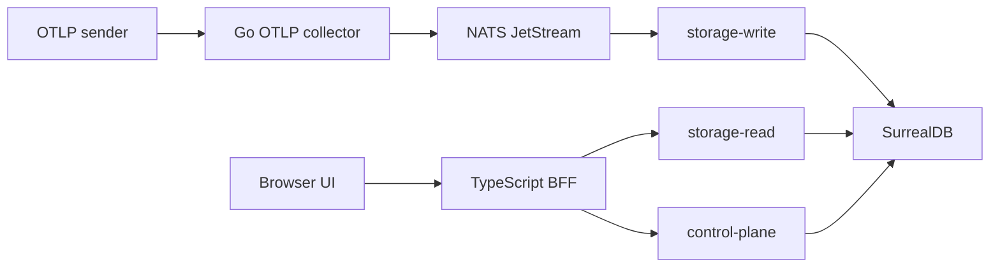

CloudGrid is an OTLP observability workspace for project-scoped traces, logs, metrics, live trace receiving, dashboards, ingest credentials, retention policies, alert management, and optional AI evaluation workflows.

This handbook is written as a product journey rather than a folder dump. Start by understanding the boundary of the product, run a stack, send telemetry, configure access, then move into daily workflows and operations.

## Recommended Path

| Step | Read | Outcome |
| --- | --- | --- |
| 1 | [What CloudGrid is](/handbook/overview/what-is-cloudgrid) | Understand the product boundary, implemented surfaces, and known production gaps. |
| 2 | [Runtime modes](/handbook/overview/runtime-modes) | Decide whether you are running local mode or deployed SSO mode. |
| 3 | [Release Compose](/handbook/getting-started/docker-compose-release) or [Local quickstart](/handbook/getting-started/local-quickstart) | Start CloudGrid either from published images or from source. |
| 4 | [Send telemetry](/handbook/getting-started/send-telemetry) | Prove the OTLP collector, bridge, writer, reader, and UI path end to end. |
| 5 | [Concepts](/handbook/concepts) | Understand companies, projects, access, signals, live traces, metrics, retention, and alerts. |
| 6 | [Guides](/handbook/guides) | Work with ingest credentials, traces, logs, metrics, dashboards, and AI evaluation. |
| 7 | [Configuration](/handbook/configuration) | Add the right local, deployed, SSO, SMTP, storage, and self-observability values. |
| 8 | [Operate](/handbook/operations) | Start, stop, monitor, troubleshoot, and assess production readiness. |
| 9 | [Architecture](/handbook/architecture) | Reason about service boundaries, flows, tenancy, and extension points. |
| 10 | [Reference](/handbook/reference) | Look up commands, ports, environment variables, routes, contracts, and errors. |

## How The Handbook Is Organized

The left navigation mirrors the journey:

| Area | What belongs there |
| --- | --- |
| Overview | Product scope, runtime modes, and the route tour. |
| Getting started | The two supported local paths and the first telemetry export. |
| Concepts | Companies, projects, access, signals, live traces, metrics, retention, and alerts. |
| Guides | Task guides for day-to-day observability work. |
| Configuration | Local mode, deployed mode, SSO, invitations, SMTP, Kubernetes, storage, and environment values. |
| Operations | Health checks, resets, bridge behavior, retention, alerting, troubleshooting, and production readiness. |
| Architecture | Internal service boundaries, flows, and extension boundaries. |
| Reference | Stable lookup tables. |

## System Thumbnail

The browser talks only to the TypeScript BFF. Public telemetry reads use GraphQL. The BFF talks to private services through NATS request/reply. The collector publishes ingest commands and never writes SurrealDB directly. Only `storage-write` mutates telemetry, and only `storage-read` fetches telemetry.

## Source Of Truth

User-facing docs explain how to use and operate CloudGrid. Implementation behavior is defined by the contract and spec sources summarized in [Contracts](/handbook/reference/contracts). If a feature is not specified and implemented, the handbook must not present it as available.
