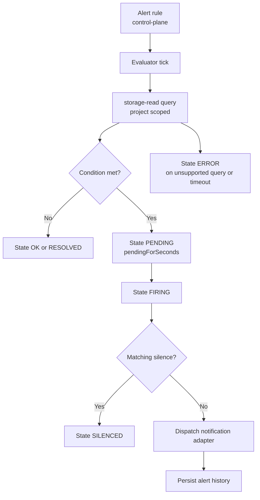

CloudGrid alerting is project-scoped. Alert rule, silence, and history CRUD is implemented through GraphQL, the BFF bridge, control-plane storage, and the alert management UI. Rule execution belongs to a dedicated alert evaluator.

## Current Product Status

CloudGrid exposes alert management surfaces:

- alert rule configuration;
- alert silences;
- in-app alert history;
- typed rule shapes over metrics, logs, and traces.

The alert evaluator is the component that executes rules, transitions states, and dispatches notifications. The repository includes evaluator domain logic, transport-neutral handlers, service project discovery, in-app/email/webhook notification adapters, dashboard alert widgets, and service image/chart shape. The evaluator also owns the bridge-backed delivery boundary: built-in in-app and email delivery are part of the core runtime, while provider-specific delivery can be added through private adapters that consume alert dispatch work from the message bridge.

## Rule Kinds

| Signal | Kinds |
| --- | --- |
| Metrics | `METRIC_THRESHOLD`, `METRIC_ABSENCE` |
| Logs | `LOG_MATCH`, `LOG_COUNT` |
| Traces | `TRACE_MATCH`, `TRACE_COUNT`, `TRACE_LATENCY`, `TRACE_ERROR` |

## Evaluation Lifecycle

## Notification Adapters

CloudGrid core provides in-app alert history and email delivery. Webhook delivery gives deployments a signed HTTPS path for customer-owned receivers.

Additional delivery paths such as Slack, WhatsApp, SMS, Teams, PagerDuty, or an internal notification gateway should be implemented as private bridge-backed adapters. Those adapters consume canonical alert dispatch requests, deliver to their provider, and return a bounded delivery result. They do not evaluate alert conditions, query telemetry, mutate alert rules, or own alert state.

Do not add notification provider secrets to dashboard widgets, frontend state, BFF responses, alert summaries, or alert history records.

## Operator Checks

When the evaluator is present, check:

- evaluator schedule/tick logs;
- rule execution duration and errors;
- storage-read query failures;
- notification delivery status;
- alert history persistence;
- silence matching;
- bridge-backed adapter lag, retry counts, and terminal delivery failures for configured third-party paths.

Invitation email SMTP is a separate onboarding path. Alert email uses the deployed SMTP runtime through the alert email adapter.

## Dashboard Thresholds

Dashboard widget thresholds are visual dashboard settings. They do not create alert rules and do not execute alert logic.

## Next Step

For alert concepts, read [Retention and alerts](/handbook/concepts/retention-alerts).
