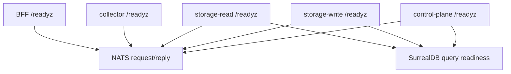

CloudGrid services expose liveness and readiness probes. Readiness returns unhealthy while required dependencies are unavailable or a service is draining.

## Probe Table

| Service | Default port | Liveness | Readiness |
| --- | --- | --- | --- |
| BFF | `3000` | `/livez` | `/readyz`, `/api/health` |
| OTLP collector HTTP | `4318` | `/livez` | `/readyz` |
| OTLP collector gRPC | `4317` | Reported by HTTP `/readyz` | Reported by HTTP `/readyz` |
| storage-read | `8081` | `/livez` | `/readyz` |
| storage-write | `8082` | `/livez` | `/readyz` |
| control-plane | `8084` | `/livez` | `/readyz` |
| AI eval runner | `8085` | `/livez` | `/readyz` |

## Local Checks

```sh
curl -fsS http://localhost:3000/readyz
curl -fsS http://localhost:4318/readyz
curl -fsS http://localhost:8081/readyz
curl -fsS http://localhost:8082/readyz
curl -fsS http://localhost:8084/readyz
```

## Readiness Dependencies



## Common Readiness Failures

| Symptom | Likely cause | Check |
| --- | --- | --- |
| BFF ready but GraphQL times out | Private service not subscribed to NATS subject | storage-read and control-plane logs |
| storage-read not ready | SurrealDB unavailable or schema readiness failed | SurrealDB logs and storage-read `/readyz` |
| collector rejects ingest | invalid auth, content type, size, or bridge publish failure | collector logs and NATS readiness |
| control-plane not ready | SurrealDB schema or configured self-observability project validation failed | control-plane logs |

## Health Versus Readiness

Liveness answers whether the process should keep running. Readiness answers whether the process should receive traffic.

Do not treat `/livez` as a dependency check. Use `/readyz` for service routing and local troubleshooting.

## Next Step

Inspect private bridge behavior with [Message bridge operations](/handbook/operations/message-bridge).
