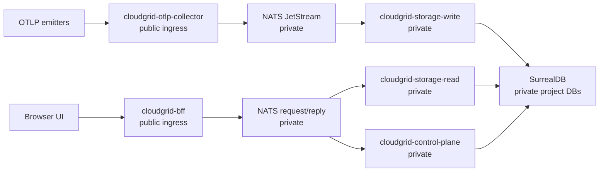
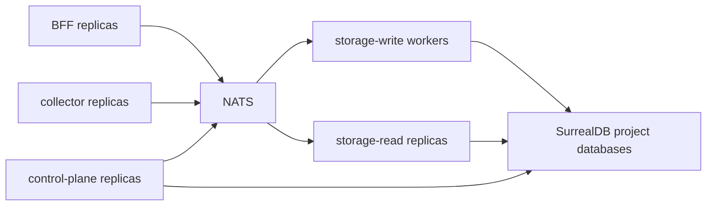

CloudGrid has implemented the main product surfaces for local and deployed-mode evaluation. Treat this page as the operator readiness map before exposing a shared CloudGrid environment.

## Implemented Surfaces

The current implementation readiness file and repository artifacts show these user-visible surfaces as implemented:

- OTLP trace, log, and metric ingest over HTTP and gRPC;
- metric query, metric explorer, and dashboard widget surfaces;
- live trace subscriptions through GraphQL, the BFF, storage-read live sessions, and storage-write post-persist notifications;
- company, project, membership, invitation, and SMTP invitation email control-plane flows;
- project retention policy CRUD in contracts, control-plane, BFF GraphQL, and project settings UI;
- project alert rule, silence, and history CRUD in contracts, control-plane, BFF GraphQL, and alert management UI;
- local Docker Compose infrastructure for NATS and SurrealDB;
- Helm chart and release workflow definitions with static release-artifact validation;
- root verification scripts and GitHub Actions verification for pull requests and pushes to `main`.

## Production Completion Packages

Do not present CloudGrid as a complete public production distribution until these packages have visible repository artifacts:

| Area | Current status |
| --- | --- |
| Release artifacts | Release workflow and Dockerfiles are present; signed images, image provenance, release manifest, SBOM output, and vulnerability reports are produced when the release workflow runs. |
| Kubernetes | Helm chart and profile overlays are present; operators still need environment-specific values, secrets, ingress/TLS, and published image digests. |
| Retention execution | Retention policy CRUD, storage-maintenance batch execution, disabled-by-default scheduling, and the SurrealDB deletion adapter are implemented; enable the scheduler per environment and run the opt-in SurrealDB retention suite before relying on deletion in production. |
| Alert execution | Alert rule/silence/history CRUD, evaluator runtime, project discovery, email/webhook adapter runtime, adapter catalog validation, and dashboard alert widgets are implemented; deployments still need concrete SMTP/webhook environment values. |
| Production scale | The performance and scaling spec defines targets and variables; opt-in local and production-like benchmark scripts are present, but each deployment still needs its own recorded benchmark run before being declared production-ready. |
| Auth hardening | Deployed-mode BFF HTTP, WebSocket, app-shell, collector, storage-read, storage-write, and control-plane authorization boundaries have acceptance coverage; operators still need configured SSO providers and secrets. |

## Deployment Boundary

Only the BFF and OTLP collector are public ingress candidates. NATS and SurrealDB stay private. SurrealDB credentials belong only in storage-read, storage-write, control-plane, and storage-maintenance service environments.

## Production Boundary Checklist

- BFF and OTLP collector are the only public ingress candidates.
- Use `CLOUDGRID_DEPLOYMENT_MODE=deployed` and `CLOUDGRID_AUTH_MODE=sso`.
- Configure a real SSO provider and a strong `CLOUDGRID_SESSION_SECRET`.
- Configure a stable `CLOUDGRID_PROVIDER_SECRET_ENCRYPTION_KEY` before allowing managed AI provider API keys in deployed mode.
- Install production Kubernetes deployments with the versioned Helm chart and digest-pinned service images.
- Verify `release-manifest.json`, `release-values.yaml`, checksums, signatures, SBOMs, scan reports, image signatures, and image digests before promotion.
- Configure SMTP invitation delivery for deployed SSO onboarding, or explicitly set disabled delivery with manual recipient notification.
- Keep project API keys in a secret manager and send them only as bearer credentials from emitters.
- Keep GraphiQL disabled except during trusted operator sessions.
- Keep local mode off untrusted networks.
- Keep NATS and SurrealDB private; use external managed or operator-owned dependencies for production.
- Use self-observability as a normal CloudGrid project with a normal ingest credential.
- Run production benchmark probes with `CLOUDGRID_BENCH_DEPLOYMENT_PROFILE=production-like`, `CLOUDGRID_BENCH_ENVIRONMENT_ID`, and `CLOUDGRID_BENCH_IMAGE_TAG` against the exact deployment.
- Run the relevant root verification commands before deployment; see [Commands](/handbook/reference/commands).

## Scaling Shape

The intended scale path is horizontal at service boundaries. Production-scale storage-write uses pull-consumer semantics once implemented and configured. Do not introduce alternate queues, public realtime protocols, frontend direct storage access, REST telemetry reads, or BFF telemetry aggregation.

## Next Step

Review [Enterprise Helm install](/handbook/configuration/deployed/helm-install), [Release artifact verification](/handbook/operations/release-verification), and [Sizing and scaling](/handbook/operations/sizing), then use [Retention operations](/handbook/operations/retention) and [Alerting operations](/handbook/operations/alerting) to understand which administrative surfaces are configured versus executed.
