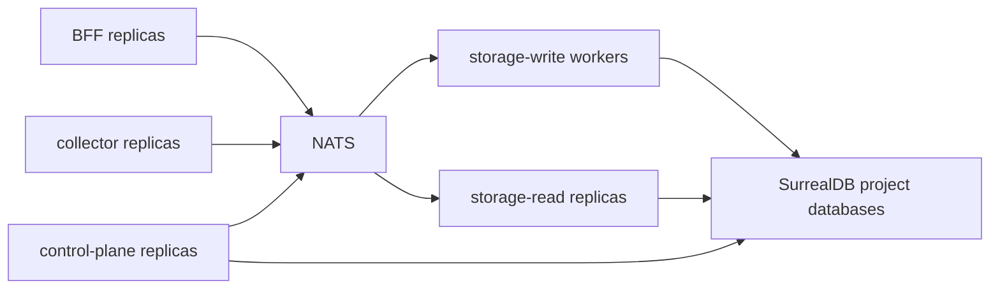

CloudGrid has a specified production distribution target, but the repository does not yet ship all release artifacts required for public or enterprise production use.

## Current State

The repository has:

- GitHub Actions verification workflow for pull requests and pushes to `main`;
- website deployment workflow;
- local Docker Compose infrastructure for NATS and SurrealDB;
- root verification scripts;
- service code and specs for the multi-service architecture.

The repository does not yet have:

- signed OCI images per deployable service;
- release workflow artifacts;
- Helm chart;
- SBOM/provenance output;
- image signing;
- production Kubernetes manifests;
- storage-maintenance retention deletion execution;
- alert evaluator execution;
- published capacity envelopes.

## Target Distribution

| Path | Target |
| --- | --- |
| Local evaluation | Docker Compose using published CloudGrid service images, NATS, and SurrealDB. |
| Enterprise Kubernetes | Versioned OCI Helm chart with configurable dependencies and digest-pinned images. |
| Developer packages | Registry-published packages only where users import them directly. |

## Production Boundary Checklist

- BFF and OTLP collector are the only public ingress candidates.
- NATS and SurrealDB remain private.
- SSO is enabled with `CLOUDGRID_DEPLOYMENT_MODE=deployed` and `CLOUDGRID_AUTH_MODE=sso`.
- SurrealDB credentials are mounted only into storage-read, storage-write, and control-plane.
- Project API keys are stored in a secret manager and sent as bearer credentials by emitters.
- Local mode is not exposed to untrusted networks.
- GraphiQL is disabled unless temporarily enabled for trusted operator sessions.
- Self-observability uses a normal project and normal ingest credential.

## Scaling Shape

The intended scale path is horizontal at service boundaries. Do not introduce alternate queues, public realtime protocols, frontend direct storage access, or BFF telemetry aggregation.

## Next Step

Review [Kubernetes and deployment status](/handbook/configuration/deployed/kubernetes) for the planned chart shape.
