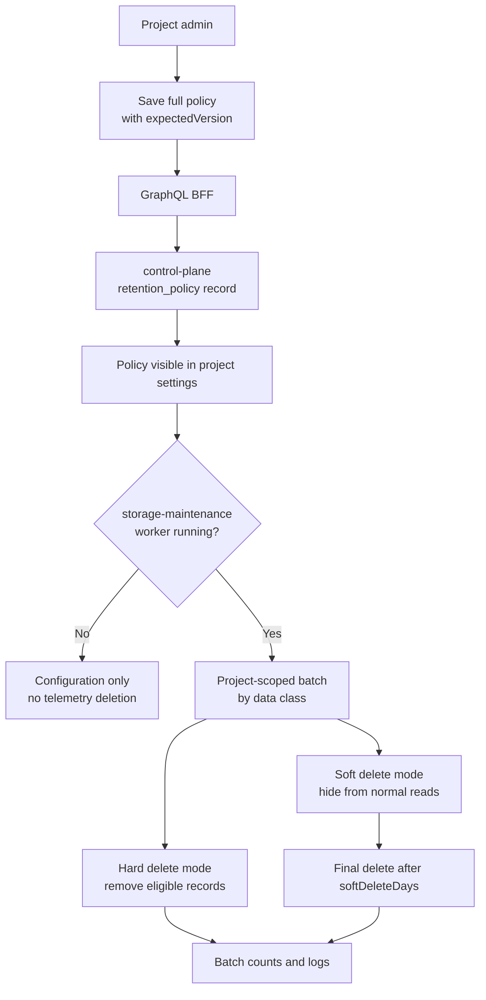

Retention is configured per project. Project retention policy CRUD is implemented through GraphQL, the BFF bridge, control-plane storage, and the project settings UI. Deletion execution is a separate storage-maintenance boundary, not frontend or BFF behavior.

## Current Product Behavior

Project admins can read and save the effective retention policy for a project. A policy has exactly one rule per data class, and updates replace the complete rule set using optimistic version checks.

Saved policies are durable configuration. The repository includes the storage-maintenance batch-executor module, service image/chart shape, and scheduler specification. Production deletion still depends on wiring the executor to the SurrealDB retention adapter and enabling the scheduler in the deployed environment.

## Data Classes

| Data class | Default |
| --- | --- |
| `TRACES` | Delete after 30 days |
| `LOGS` | Delete after 30 days |
| `METRICS` | Delete after 30 days |
| `AI_EVALS` | Delete after 90 days |
| `DATASETS` | Retain |
| `SCORERS` | Retain |
| `DASHBOARD_HISTORY` | Retain |
| `INGEST_CREDENTIAL_AUDIT` | Delete after 365 days |

Dashboard definitions, current project configuration, users, companies, memberships, and active ingest credential metadata are not deleted by telemetry retention.

## Lifecycle

## Operator Checks

When deletion execution is present, operators should check:

- project ID and data class in maintenance logs;
- matched, hard-deleted, soft-deleted, and final-deleted counts;
- policy version used by the batch;
- terminal errors and retry behavior;
- confirmation that no deletion crosses tenant/company/project boundaries.

## Specified Scheduler Configuration

The production scheduler contract is specified, but the runtime wiring is still pending. It stays disabled by default until the SurrealDB retention adapter is enabled.

| Variable | Default | Purpose |
| --- | --- | --- |
| `CLOUDGRID_RETENTION_SCHEDULER_ENABLED` | `false` | Enables scheduled deletion in storage-maintenance. |
| `CLOUDGRID_RETENTION_SCHEDULER_INTERVAL_SECONDS` | `3600` | Tick cadence, from 5 minutes to 24 hours. |
| `CLOUDGRID_RETENTION_SCHEDULER_PROJECT_IDS` | none | Comma-separated project IDs for the first production wave. |
| `CLOUDGRID_RETENTION_BATCH_LIMIT` | `1000` | Maximum rows per project/data-class batch. |
| `CLOUDGRID_RETENTION_LEASE_SECONDS` | `900` | SurrealDB-backed lease duration per project/data class. |

When implemented, the scheduler iterates configured project IDs and every retention data class. One failed project/data class does not stop the rest of the tick. Multiple storage-maintenance replicas coordinate with a SurrealDB lease key shaped as `retention:{projectId}:{dataClass}`.

Do not add custom runbook commands around retention until the executable exposes them. The private batch contract is `storage_maintenance.retention.execute_batch`.

## Safety Rules

- Retention deletion must be project-scoped.
- Soft-deleted records are hidden from normal GraphQL reads.
- `retain` means no automatic deletion for that data class.
- The BFF and frontend must not implement deletion loops.
- Storage-write remains the normal telemetry mutator; retention deletion is a maintenance mutation boundary.

## Next Step

Review the concept page: [Retention and alerts](/handbook/concepts/retention-alerts).
