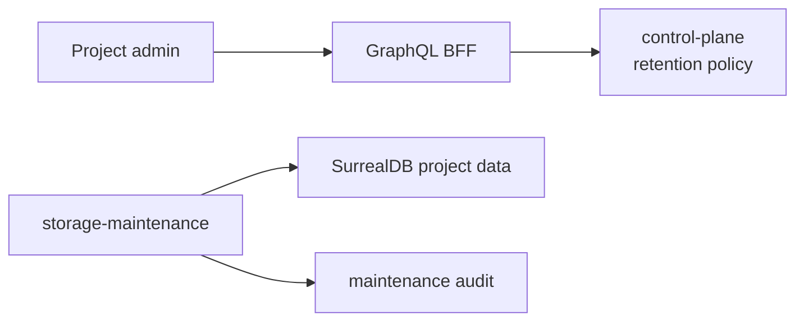

Retention is configured per project. Execution is owned by a storage-maintenance boundary, not the frontend or BFF.

## Current Product Behavior

Project admins can save retention policies in project settings when the backing contracts are implemented. A policy has one rule per data class.

Actual deletion requires the storage-maintenance worker and retention batch contracts. Until that worker is running, policy changes are saved and visible but do not remove telemetry from SurrealDB.

## Data Classes

| Data class | Default |
| --- | --- |
| `TRACES` | Delete after 30 days |
| `LOGS` | Delete after 30 days |
| `METRICS` | Delete after 30 days |
| `AI_EVALS` | Delete after 90 days |
| `DATASETS` | Retain |
| `SCORERS` | Retain |
| `DASHBOARD_HISTORY` | Retain |
| `INGEST_CREDENTIAL_AUDIT` | Delete after 365 days |

Dashboard definitions, current project configuration, users, companies, memberships, and active ingest credential metadata are not deleted by telemetry retention.

## Execution Shape

## Operator Checks

When deletion execution is implemented and running, operators should check:

- project ID and data class in maintenance logs;
- matched, hard-deleted, soft-deleted, and final-deleted counts;
- policy version used by the batch;
- terminal errors and retry behavior;
- confirmation that no deletion crosses tenant/company/project boundaries.

## Safety Rules

- Retention deletion must be project-scoped.
- Soft-deleted records are hidden from normal GraphQL reads.
- The BFF and frontend must not implement deletion loops.
- Storage-write remains the normal telemetry mutator; retention deletion is a maintenance mutation boundary.

## Next Step

Review the concept page: [Retention and alerts](/handbook/concepts/retention-alerts).
