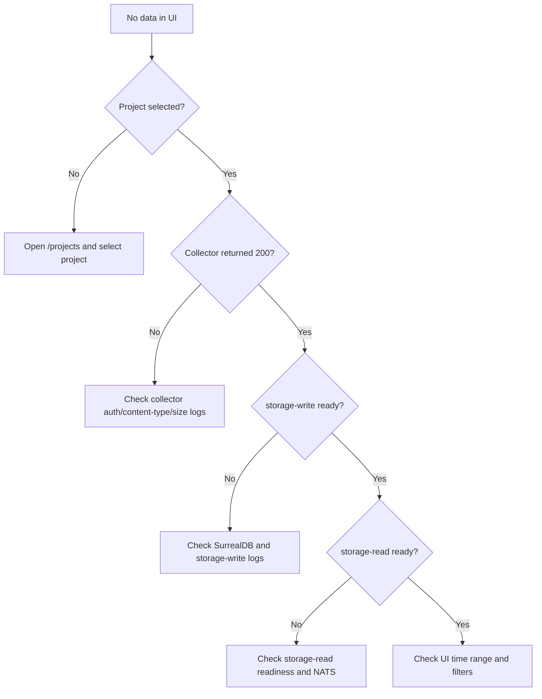

This page maps common symptoms to the most likely CloudGrid boundary.

## First Checks

```sh
docker compose --env-file .env ps
curl -fsS http://localhost:3000/readyz
curl -fsS http://localhost:4318/readyz
curl -fsS http://localhost:8081/readyz
curl -fsS http://localhost:8082/readyz
curl -fsS http://localhost:8084/readyz
```

## Common Problems

| Problem | What to check |
| --- | --- |
| Frontend shows no telemetry | Confirm a project is selected, ingest returned `200`, storage-write is ready, storage-read is ready, and the UI time range includes the data. |
| BFF logs `MESSAGE_BRIDGE_TIMEOUT` | Confirm storage-read and control-plane are running and connected to the same `CLOUDGRID_NATS_URL`. |
| Collector returns `ERR-015` | Missing auth in deployed mode or local token mode. |
| Collector returns `ERR-016` | Token lacks required ingest scope, project is not active, or local token is unknown. |
| Metrics explorer has no series | Confirm `/v1/metrics` ingest returned `200`, selected time range includes points, and storage-read can query metric names and series. |
| Dashboard widget is empty | Run the same metric, log, or trace query in `/metrics`, `/logs`, or `/traces`. Widgets use the same project-scoped GraphQL queries. |
| Live view stalls | Check storage-write post-persist notifications, storage-read live session logs, and BFF WebSocket logs. |

## Debug Flow



## Error Mapping

CloudGrid public errors use canonical codes from `specs/03-contracts/errors.yaml`.

| Code | Typical meaning |
| --- | --- |
| `ERR-001` | Validation failed. |
| `ERR-002` | Unsupported media type. |
| `ERR-003` | Invalid cursor. |
| `ERR-006` | Storage unavailable. |
| `ERR-009` | Runtime configuration invalid. |
| `ERR-013` | Message bridge unavailable. |
| `ERR-014` | Message bridge timeout. |
| `ERR-015` | Authentication required. |
| `ERR-016` | Authorization forbidden. |

## Next Step

Use [Health and readiness](/handbook/operations/health-readiness) and [Message bridge operations](/handbook/operations/message-bridge) for deeper checks.
