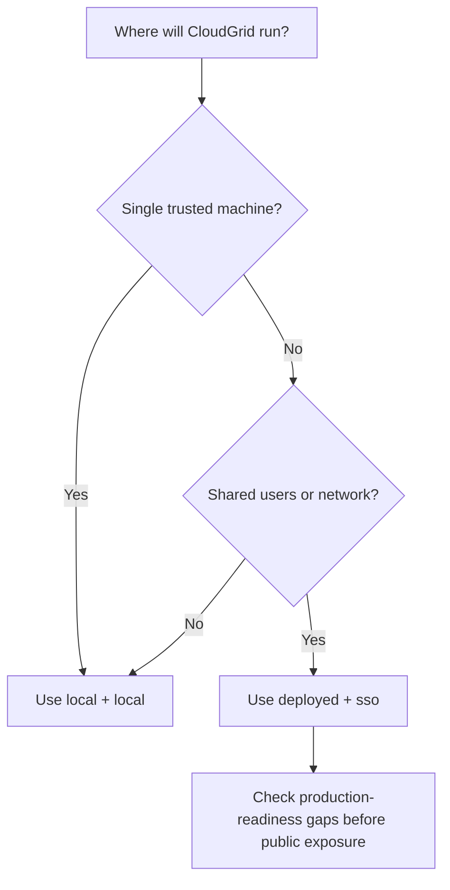

CloudGrid has two supported runtime mode pairs. The deployment mode and auth mode must match.

| Deployment mode | Auth mode | Use for | Login | Company model |
| --- | --- | --- | --- | --- |
| `local` | `local` | Development, local evaluation, trusted demos | No login | One visible local company named `Personal` |
| `deployed` | `sso` | Shared environments and production-target deployments | GitHub, Google, or Azure Entra ID SSO | Configured deployed company boundary |

Invalid combinations fail startup with `ERR-009 CONFIG_INVALID`:

- `CLOUDGRID_DEPLOYMENT_MODE=local` with `CLOUDGRID_AUTH_MODE=sso`
- `CLOUDGRID_DEPLOYMENT_MODE=deployed` with `CLOUDGRID_AUTH_MODE=local`
- `CLOUDGRID_AUTH_MODE=sso` without `CLOUDGRID_AUTH_PROVIDERS`
- enabled SSO providers without their required provider variables

## Local Mode

Local mode is optimized for the first useful experience:

```sh
CLOUDGRID_DEPLOYMENT_MODE=local
CLOUDGRID_AUTH_MODE=local
```

In local mode, CloudGrid bootstraps the `Personal` company and durable local projects. The ordinary application project is `default`; the local CloudGrid service telemetry project is `cloudgrid-system` when self-observability is enabled.

Local mode still keeps the same architectural boundary:

- frontend talks only to the BFF;
- BFF reads through private services;
- collector publishes ingest commands;
- storage services own SurrealDB access.

## Deployed SSO Mode

Deployed mode prepares CloudGrid for shared usage:

```sh
CLOUDGRID_DEPLOYMENT_MODE=deployed
CLOUDGRID_AUTH_MODE=sso
CLOUDGRID_AUTH_PROVIDERS=github,google,azure
CLOUDGRID_AUTH_COMPANY_ID=acme
```

The BFF owns browser login, callback, logout, and session cookies. Provider access tokens never reach the frontend. The first SSO user for an empty configured company becomes company admin. Later users need a company invitation accepted through a matching verified SSO email.

## Decision Flow



## Next Step

For a laptop setup, continue with [Local quickstart](/handbook/getting-started/local-quickstart). For shared mode configuration, start with [Deployed configuration](/handbook/configuration/deployed).
