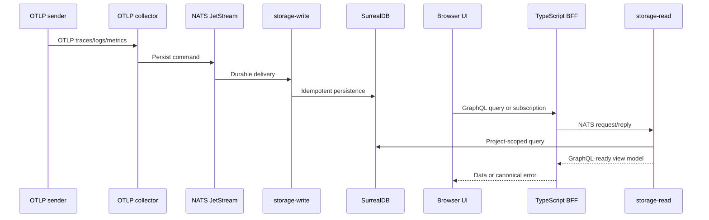

CloudGrid is a focused observability application for OpenTelemetry data from services and AI-agent workloads. It receives OTLP traces, logs, and metrics, stores them behind private Go services, and exposes investigation workflows through a TypeScript GraphQL BFF and a React UI.

## Who It Is For

CloudGrid is for engineers who already emit OpenTelemetry and want a local or small-team workspace for debugging service and agent behavior without running a full production observability stack.

Primary users:

| User | Main job |
| --- | --- |
| Local developer | Run CloudGrid locally, create a project, send OTLP data, and inspect traces, logs, and metrics. |
| Team engineer | Select a project, investigate telemetry, pivot between evidence, and share URLs. |
| Platform admin | Manage projects, members, ingest credentials, retention policies, and alert rules. |
| AI-agent engineer | Create datasets, run evaluations, inspect metric results, compare candidates, and review optimization evidence when AI Eval is enabled. |

## What CloudGrid Does Today

- Accepts OTLP/HTTP JSON and protobuf for traces, logs, and metrics on `4318`.
- Accepts OTLP/gRPC protobuf for traces, logs, and metrics on `4317`.
- Routes ingestion through NATS JetStream to `storage-write`.
- Persists telemetry in SurrealDB through private Go services.
- Reads telemetry through GraphQL queries served by the TypeScript BFF.
- Streams live trace updates through GraphQL subscriptions backed by `storage-read`.
- Manages companies, projects, memberships, ingest credentials, dashboards, retention policies, and alert records through `control-plane`.
- Executes project alert rules through the alert evaluator, with in-app/email delivery and bridge-backed adapter paths for provider-specific notifications.
- Supports local no-login mode and deployed SSO mode.
- Supports optional AI evaluation and optimization workflows behind a feature flag.

## What Is Still Production-Readiness Work

The specs define the production target, and the repository now includes release workflow and Helm chart definitions. Published signed service images, SBOM/provenance output, and release manifests exist only after the release workflow runs. Retention policy CRUD and alert rule/silence/history CRUD are implemented; production retention deletion still depends on enabling the storage-maintenance scheduler and SurrealDB retention adapter for the target deployment. Alert execution, project discovery, dashboard alert widgets, and in-app/email/webhook delivery are implemented; provider-specific delivery such as Slack, WhatsApp, SMS, or incident tools uses the bridge-backed adapter path.

Do not configure CloudGrid local mode on an untrusted network. Local mode intentionally skips login.

## Core Data Flow

## Next Step

Choose a runtime mode in [Runtime modes](/handbook/overview/runtime-modes), then run the local stack with [Local quickstart](/handbook/getting-started/local-quickstart).
